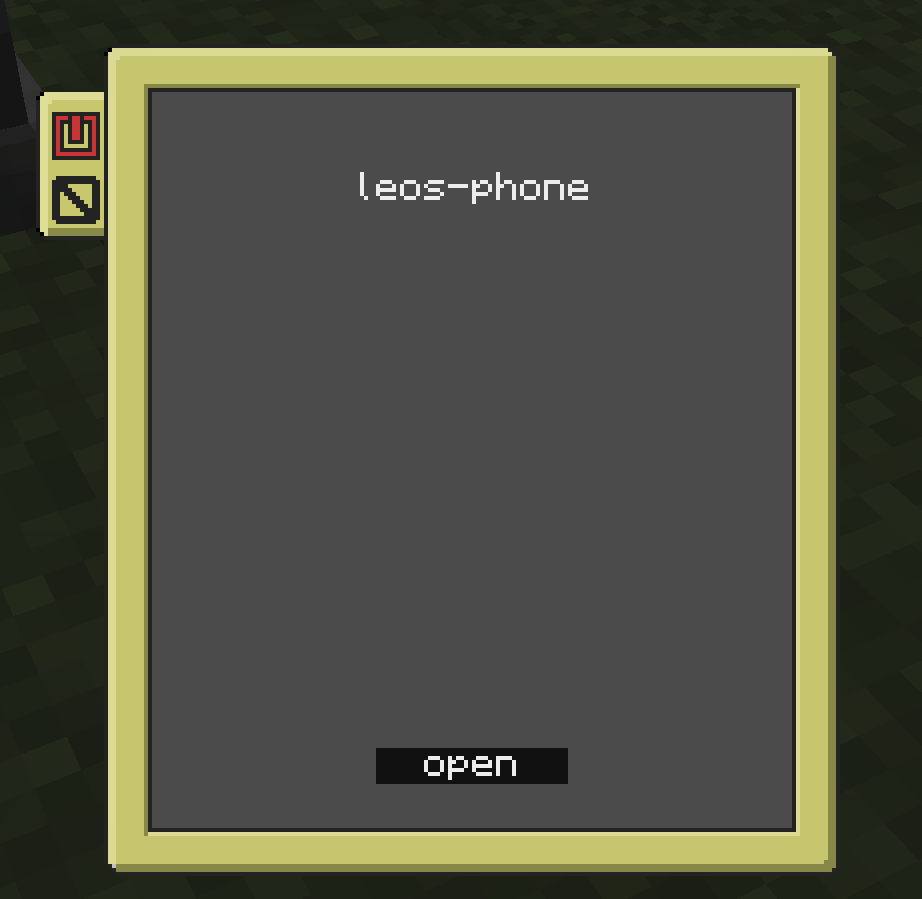
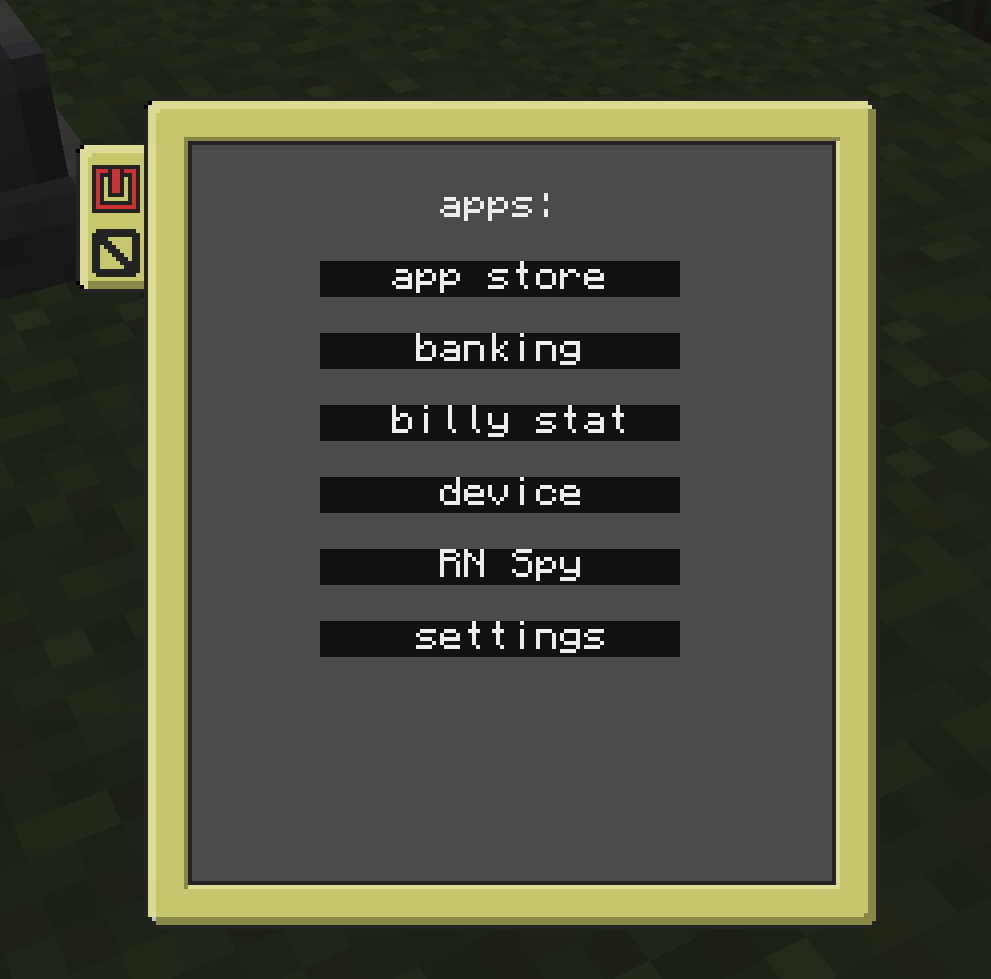
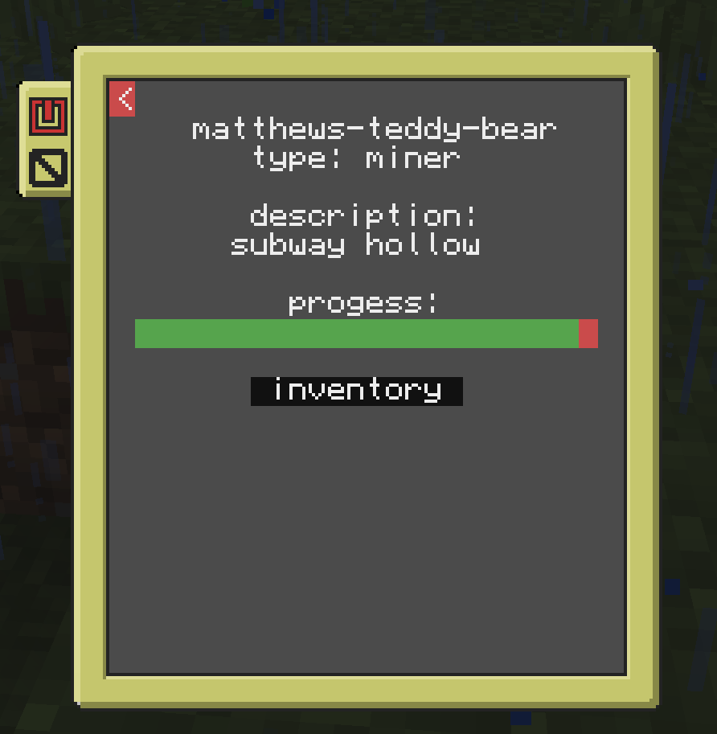
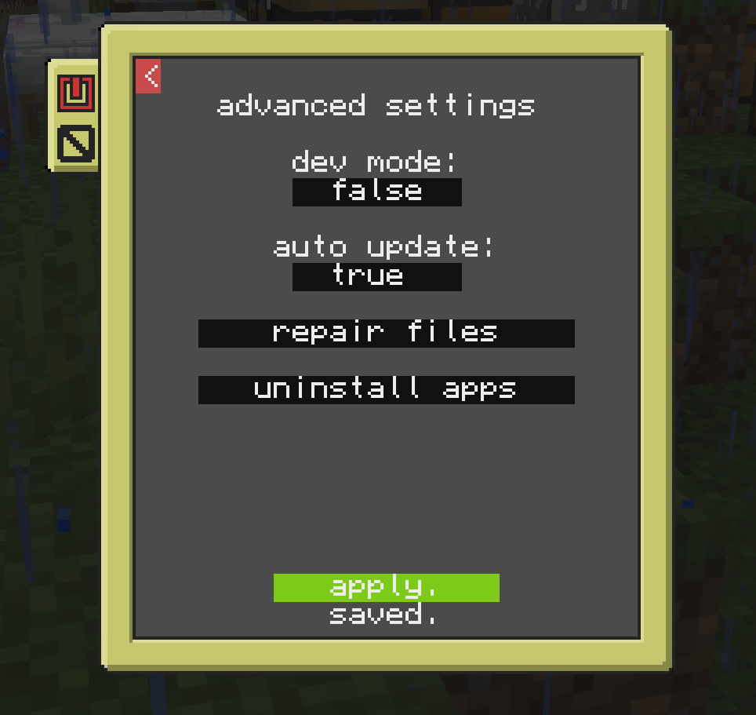

# ccPhone
An expandable phone in computer craft. creating apps is below the images.
to install just run the below code on the phone/server, it will bring you through the steps.
```
pastebin run EzLeKNHy
```






i will never update the phone/ directory, as there is no reason to, the second you turn it on it will update itself with the server.
if you want to make an app, you put all lua files in the files/files directory in the server. then you will have to make a file listing all data about the app in files/apps that will look like this:
```
{
  name = "app name",
  file = "files/mainAppFile.lua",
  id = "appId",
  version = "1.0.0",
}
```
the name var is what will show up in the apps screen, the file var is the path to the main file that the phone will run when you open it. id is for the server, which ill get into more later, and the version is to check with the server if its updated.
if you want to make it so you can uninstall the app, make a file in files/uninstall that will look like this:
```
{
    name = "app name",
    files = {
        "file1path",
        "file2path",
        "file3path",
    },
}
```
the name is what will show up in the uninstall menu, and the files list is all of the files that will be removed. this should includ the uninstall file, the main file, the file in apps, and any others.
to set the app up on the server, so it wil be updated whenever you open the app, make a file in apps (not files/apps) which should look like this:
```
{
    id = "appId",
    files = {
        "file1path",
        "file2path",
        "file3path",
    },
    version = "1.0.0",
}
```
the id is what i was talking about earlier, it should be the same as the other one. all of the files, same as the uninstall app, its every file that should be downloaded/updated. the version file is what the phone will talk to to check if they should update. the version should always be the same as the other apps file, otherwise the app will try to update every time you launch the app.
to add the app to the app store, just make a file in the appstore directory like this:
```
{
    name = "name",
    id = "appId",
    desc = "description",
}
```
just by adding this file it will show up in the app store, i dont feel like explaining wha the variables are again because they are obvious.

for adding your app in the settings app, just make another lua file for the settings app to open, it works the same way as just oppening a app, and you should put that file in files/files/settings. then make a file in files/settingData and it should look like this:
```
{
  name = "name",
  file = "files/settings/settingFile.lua",
}
```
the settings app will read this file and add it too the settings app. if you have any questions just ask me on discord (hello_human) or make a issue thing on github
